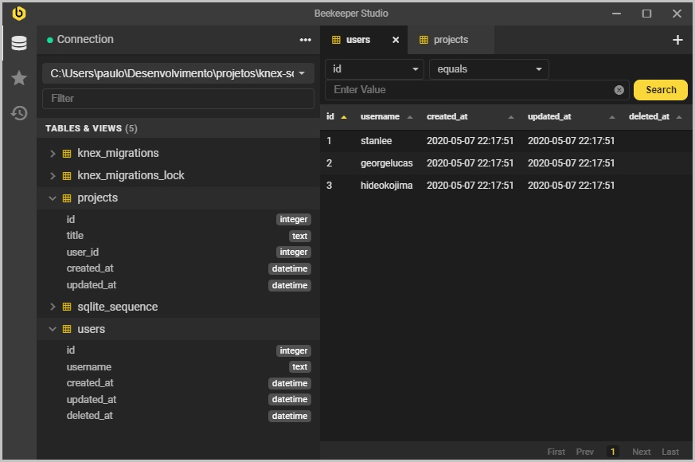
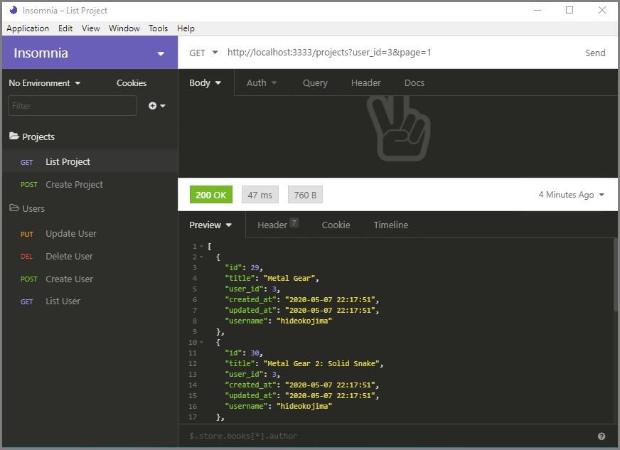
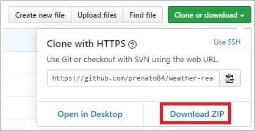

# :open_file_folder: KnexJS Sqlite CRUD

Users CRUD with projects related to them.

Uses Knex JS for ORM, migrations and seeds.

For the database, I chose SQLite 3.

The projects has an API for listing, creating, updating and soft deleting the users. Is also has an API for listing and creating projects.

The projects listing has pagination of 5 projects per page and also returns the total count of project inside the Http Header.

The images above show a little bit of the database using Beekeeper Studio DB Manager and the API using the software Insomnia Core.

<p align="center">
  
</p>

<p align="center">
  
</p>

### :keyboard: Installation and Execution

- Clone this repo

```
> git clone https://github.com/prenato84/youtube-videos-react.git
```

- Go inside the project's main folder

```
> cd knex-sqlite-crud
```

- Install the dependencies

```
npm install
```

- Start the project

```
npm start
```

- Create tables using knex migrations:

```
npx knex migrate:latest
```

- Populates users and projects tables using knex seed files

```
npx knex seed:run
```

### :bookmark_tabs: API Description

Projects pagination (5 projects per page)

> http://localhost:3333/projects?page=2

    It returns the total count of projects (X-Total-Count) inside the Http Header

User_ID's projects

> http://localhost:3333/projects?user_id=2

Deleting an user (DELETE Method at the URL)

> http://localhost:3333/users/1

    The user is not deleted from the database; instead it has its column 'deleted_at' setted with a timestamp. The API does not return soft deleted users, neither their projects.

Updating an user (UPDATE Method at the URL)

> http://localhost:3333/users/1

```json
{
  "username": "stan lee"
}
```

### :man_technologist: Requirements

- Javascript interpreter **[Node JS](https://nodejs.org/en/download/)**
- Version control system **[Git](https://git-scm.com/)**

OBS: if you don't want to use Git, you can download the project's zip file directly from the Project's GitHub Page as shown below:

<p align="center">
  
</p>

### :memo: License

This project is under the MIT license.

---

Developed with 💜 by <a href="https://www.linkedin.com/in/prenato84">Paulo Castro</a> :wave:
